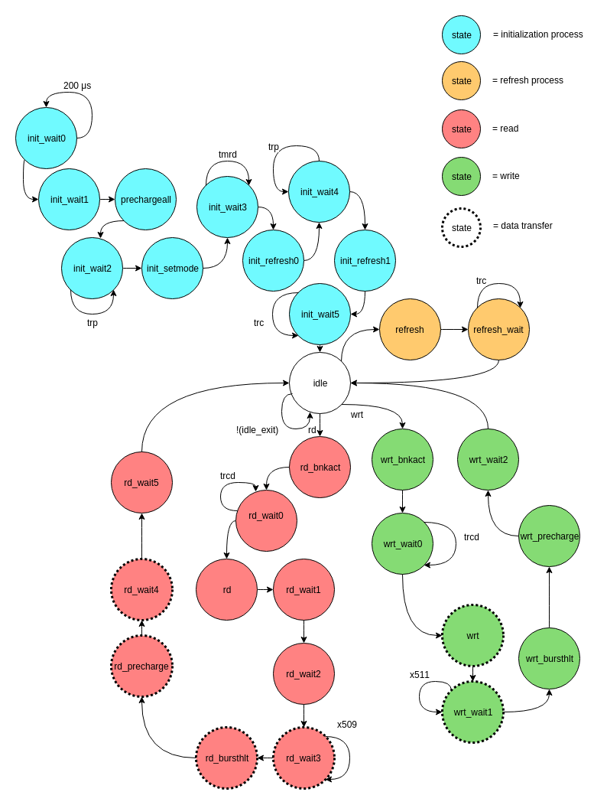

# SDRAM

#### What is SDRAM?

SDRAM stands for Synchronous DRAM, or Synchronous Dynamic Random Access Memory. SRAM, or Static Random Access Memory, the fast style of memory found in cache memory on the CPU die, is made up of transistors that form a circuit that has similar behavior to a latch or flip-flop. DRAM and SDRAM, however, use small capacitors to store each bit, and as a result, DRAM-style memories are much cheaper per byte than SRAM.
Because DRAM uses capacitors to store data, each bit must be refreshed frequently to maintain its state. Fortunately, SDRAM modules have control circuitry that automates a lot of the maintainance tasks surrounding DRAM, so memory controllers that interface with SDRAM aren't as difficult to design.
That being said, SDRAM presents a far more complex interface than SRAM.

#### Why am I Doing This?

The FPGA development board that I own, the miniSpartan6+, comes with a 16Mx16bit (256Mb, 32MB) DDR SDRAM chip, presumably to provide a large memory and keep the cost of the board down.
In my muCPU project, I used distributed RAM in the FPGA, which used up a large amount of resources. I hoped to write an SDRAM controller for that project, but never got around to it.
Now, I'm preparing to design a complete "computer" on the miniSpartan6+, and I want to utilize the on-board SDRAM.

#### First Steps

In order to write a controller for a peripheral device, I know that I need to understand very well both the operation of the intended device as well as the protocol required to communicate with it. Starting this project, all I knew about SDRAM was what the acronym stood for along with the fact that it uses capacitors instead of transistors to store data.
One of the first confusing things for me was how the chip I was using could have 16M addresses but only a 13-bit address (2^13 = 8192 or 8K). It was then that I realized how different SDRAM is from SRAM. One must first activate a row in a bank (supplying what constitutes a 15-bit address in my case, 2-bit bank + 13-bit row address), and then supply a 9-bit column address when reading. This totals to 24 bits of address, which makes sense because 2^24 = 16M.
One of the neat things about SDRAM that allows it to perform very well despite the large latencies reads experience at high clock frequencies is its capability to burst. The particular SDRAM I am using allows for 1-word, 2-word, 4-word, 8-word, and full-page (512-word) bursts. Because I plan on using a caching hierarchy on the FPGA, I opted for the 512-word burst because it will allow me maximum bandwith, and I only need to read/write to memory when a cache miss occurs. This simplifies the SDRAM controller a lot because I don't have to add optimization logic to group requests for addresses in the same bank/row.

#### Other Projects

I'm certainly not the first one to design an SDRAM controller in VHDL to run on an FPGA. As such, there are tons (not that many, but a lot) of SDRAM controllers out there, some of which would probably work on my board with not too much tweaking. However, as I intend to build the whole CPU-core and its peripheral interfaces from scratch, I opted to use others designs purely as reference and learning material. I most heavily relied on Mike Field's two SDRAM controllers (http://hamsterworks.co.nz/mediawiki/index.php/SDRAM_Memory_Controller and http://hamsterworks.co.nz/mediawiki/index.php/Simple_SDRAM_Controller), and obviously, the datasheet of the part I am using.

#### Finite State Machine

At the heart of the SDRAM controller is a Finite State Machine, or FSM. Before I started writing VHDL, I created a diagram in order to more easily 